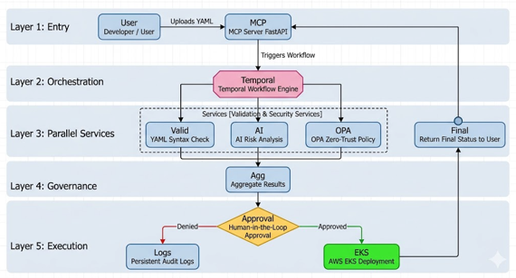
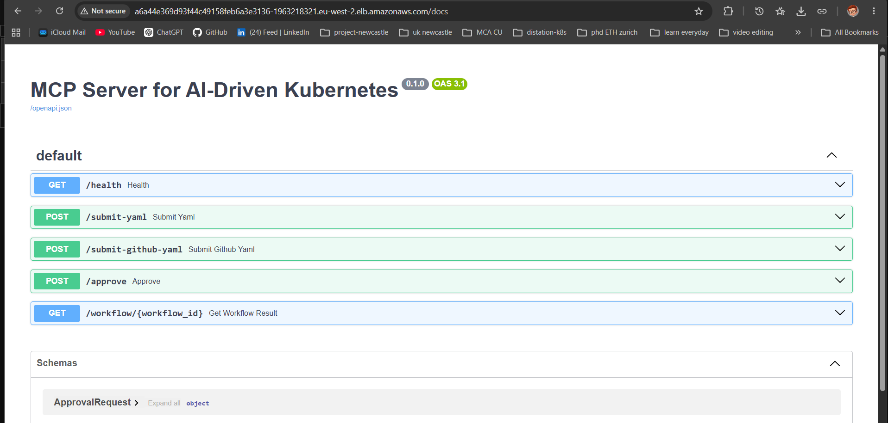
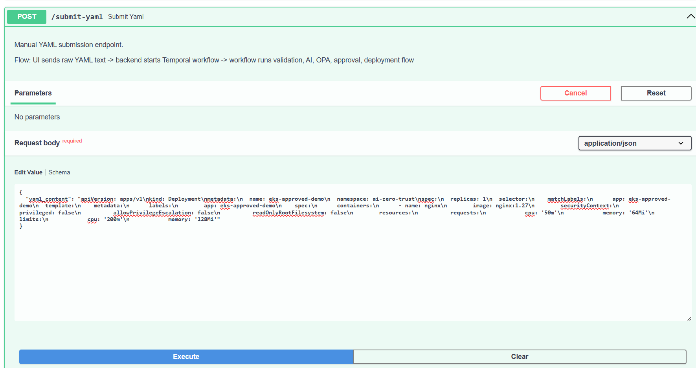
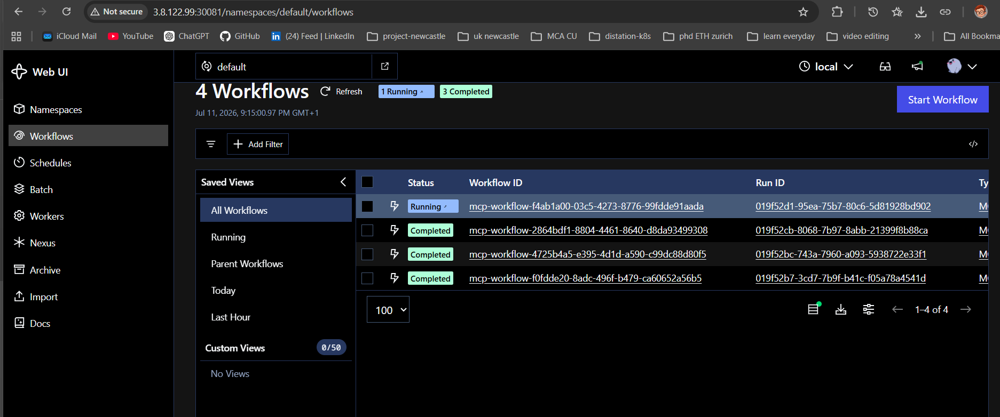
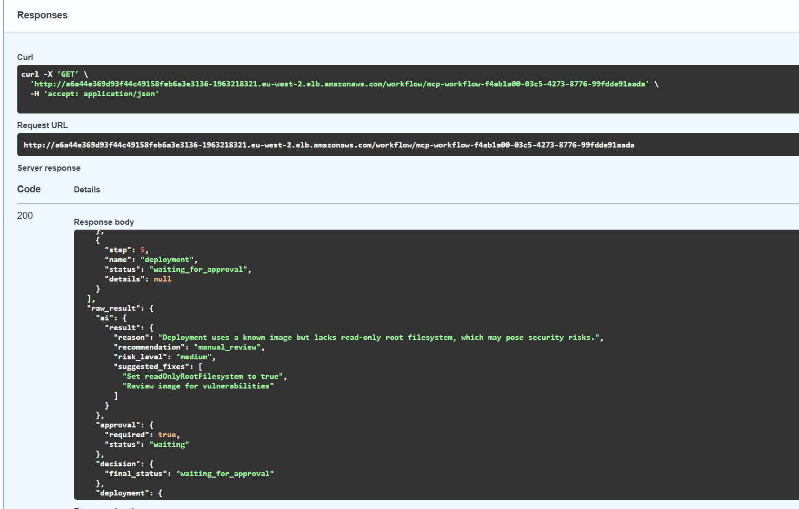
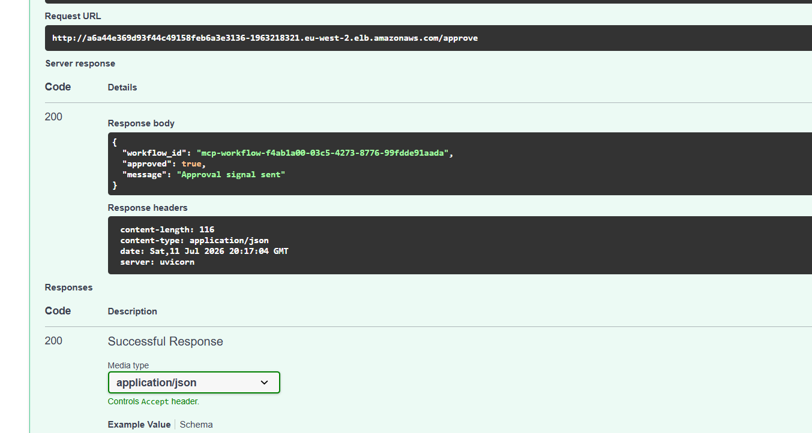
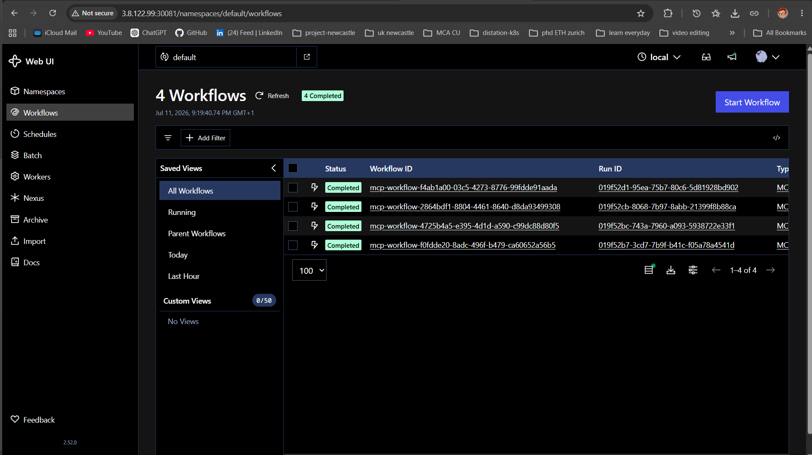
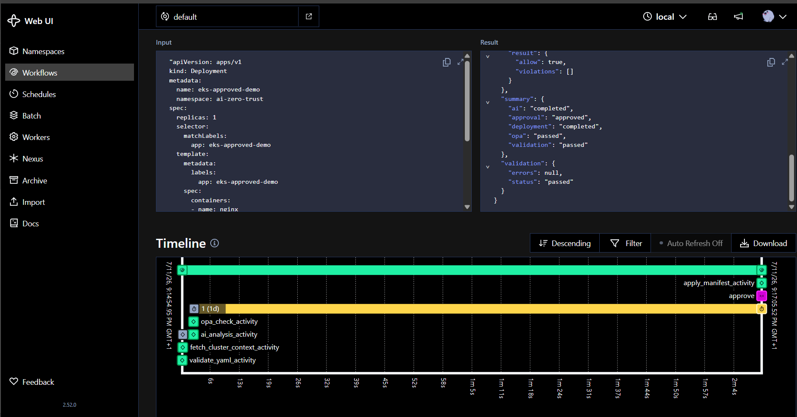
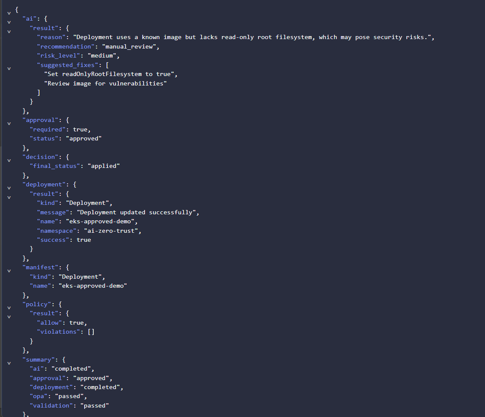
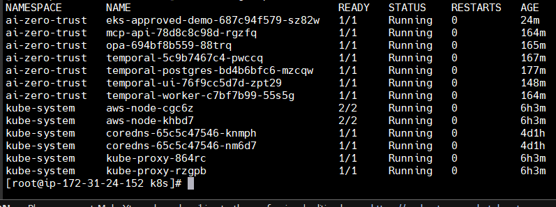

# AI-Driven Zero-Trust Kubernetes Deployment Framework

## 🎯 Project Aim

The aim of this project is to develop an AI-driven Zero-Trust deployment framework for Kubernetes that improves the security and reliability of cloud-native application deployments.

The framework acts as an intelligent deployment gateway by validating Kubernetes manifests through multiple security layers, including YAML validation, Open Policy Agent (OPA) policy enforcement, AI-powered security risk analysis, and a human approval workflow before allowing deployments to Amazon Elastic Kubernetes Service (Amazon EKS).

By combining workflow orchestration with Temporal, policy-based security using OPA, and AI-assisted decision making, the system helps prevent insecure deployments, automate governance, and ensure that only validated and approved workloads are deployed into production Kubernetes environments.

An intelligent deployment gateway that validates Kubernetes manifests using Open Policy Agent (OPA), AI-powered risk analysis, Temporal workflows, and human approval before securely deploying workloads to Amazon EKS.

---

## Overview

Traditional Kubernetes deployments mainly validate YAML syntax before deployment.

However, syntax validation alone cannot detect security risks such as:

- latest image tags
- missing resource limits
- privileged containers
- insecure networking
- policy violations

This project introduces an AI-powered Zero-Trust deployment gateway that performs multiple validation stages before allowing any workload to reach an Amazon EKS cluster.

The framework combines:

- FastAPI
- Temporal Workflows
- Open Policy Agent (OPA)
- OpenAI Risk Analysis
- Human Approval
- Amazon Elastic Kubernetes Service (EKS)

Only workloads that successfully pass every validation stage are deployed.
---

## Features

- Zero Trust Deployment Pipeline
- Kubernetes YAML Validation
- Open Policy Agent Policy Enforcement
- AI Security Risk Analysis
- Human Approval Workflow
- Amazon EKS Deployment
- Dockerized Services
- Temporal Workflow Orchestration
- REST API
- Policy-based Deployment Decisions
- Audit Logging
- Containerized Architecture
- 
---

  ## Deployment Workflow

1. Developer submits Kubernetes YAML.
2. FastAPI receives the request.
3. Temporal starts a deployment workflow.
4. OPA validates security policies.
5. OpenAI analyzes deployment risks.
6. Human approval is requested if required.
7. Deployment proceeds only after successful validation.
8. Kubernetes deploys the workload into Amazon EKS.

---

# 📊 Testing & Evaluation

The **AI-Driven Zero-Trust Kubernetes Deployment Framework** was thoroughly evaluated to verify the correctness, security, and reliability of the complete deployment workflow. The evaluation included Kubernetes YAML validation, Open Policy Agent (OPA) policy enforcement, AI-powered security risk analysis, human approval, and end-to-end deployment to Amazon Elastic Kubernetes Service (Amazon EKS).

The results demonstrate that the framework successfully prevents insecure deployments while ensuring that only validated and approved workloads are deployed into the Kubernetes cluster.

## ✅ Evaluation Summary

| Evaluation | Description | Status |
|------------|-------------|:------:|
| 📝 YAML Validation | Validated Kubernetes manifest syntax and required fields before execution | ✅ Passed |
| 🔒 OPA Policy Enforcement | Blocked insecure Kubernetes configurations using Zero-Trust policies | ✅ Passed |
| 🤖 AI Risk Analysis | Classified deployment risk and generated security recommendations | ✅ Passed |
| 👨‍💼 Human Approval Workflow | Required administrator approval before production deployment | ✅ Passed |
| ☁️ Amazon EKS Deployment | Successfully deployed approved workloads to Amazon EKS | ✅ Passed |

---

## 📈 Evaluation Results

| Test Metric | Result |
|-------------|:------:|
| YAML Validation | ✅ 100% |
| OPA Policy Evaluation | ✅ 100% |
| AI Risk Analysis | ✅ 100% |
| Human Approval | ✅ 100% |
| Workflow Execution | ✅ 100% |
| Amazon EKS Deployment | ✅ 100% |

---

## 📷 Evaluation Screenshots

## 🏗️ System Architecture

The framework validates Kubernetes manifests using parallel security services, AI-based risk analysis, policy enforcement, and a human approval stage before securely deploying workloads to Amazon EKS.

  

## 📚 Swagger API Documentation

The project exposes REST APIs for Kubernetes deployment validation and approval.

  

## 🚀 Submit Kubernetes Manifest

Developers submit a Kubernetes deployment manifest through the FastAPI endpoint.

  

## ⚙️ Workflow Started

A new Temporal workflow is automatically created after receiving the deployment request.

  

## ⏳ Waiting for Human Approval

The workflow pauses until an administrator reviews and approves the deployment.

  

## ✅ Deployment Approval

The administrator approves the deployment through the Approval API.

  

## 🎉 Workflow Completed

After approval, the deployment workflow completes successfully.

  

## 📈 Temporal Workflow Timeline

Temporal provides a complete execution timeline for every deployment.

  

## ☁️ Deployment Result

The deployment has been successfully applied to Amazon EKS.

  

## 🚀 Running on Amazon EKS

The deployed application is successfully running in the Kubernetes cluster.

  

---

## 🎯 Conclusion

The evaluation confirms that the proposed framework successfully integrates **Kubernetes YAML validation**, **Open Policy Agent (OPA)**, **AI-powered security risk analysis**, **Temporal workflow orchestration**, **human approval**, and **Amazon EKS deployment** into a unified **Zero-Trust deployment pipeline**.

The framework effectively prevents insecure deployments, automates deployment governance, and ensures that only validated and approved workloads are deployed into production Kubernetes environments.

---

